# Report
## A short description of the overall project in your own words. (200 words or less)

We build our first deep neural network according to instructions. Then we learned the process of training the model. After that, we examined our model. In addition, we did transfer learning to let our model recognize greek letters. After that, we carete our own datasets which are handwriten digits for letting the model to recognize. Finally, we did some experiments about the neural networks about dropout rates of the Dropout layer, activation function for each layer, number of epochs of training, batch size on the FASHION-MNIST.

## Any required images along with a short description of the meaning of the image.
* task1-a

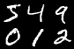

* task1-c
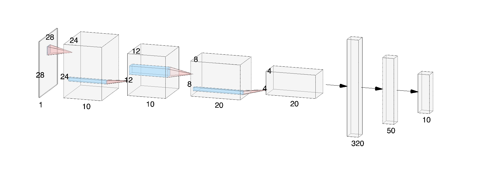

* task1-d
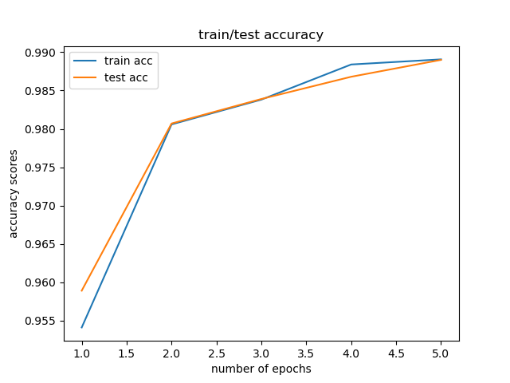
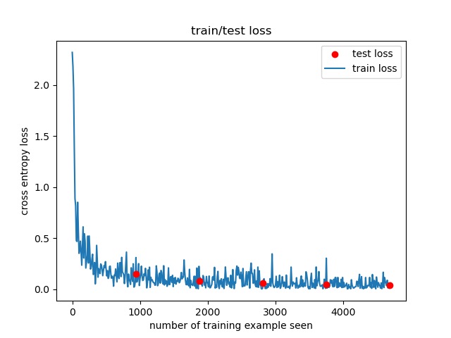

* task1-f
We use the MNIST training dataset for model prediction
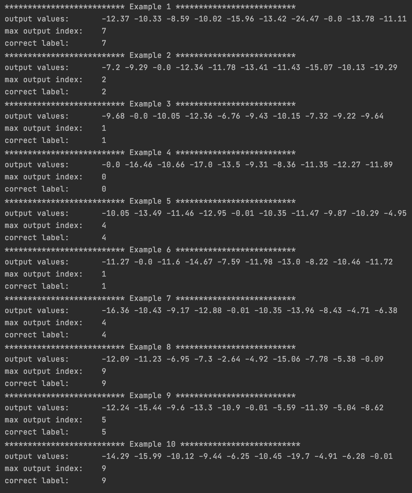
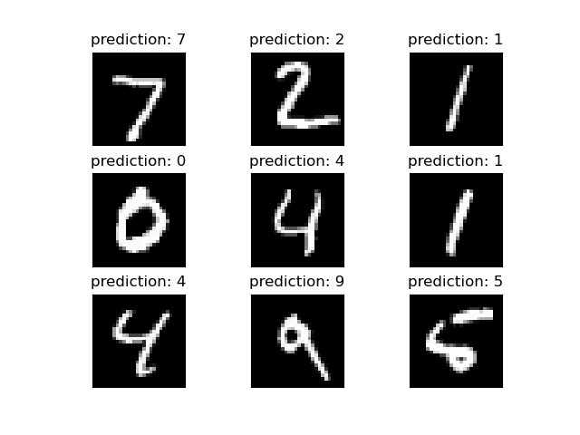

* task1-g
The results of prediction of our handwritten inputs 
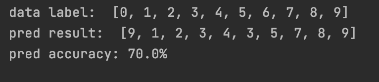

* task2
that's the filter effect and layer weights. They all make sense
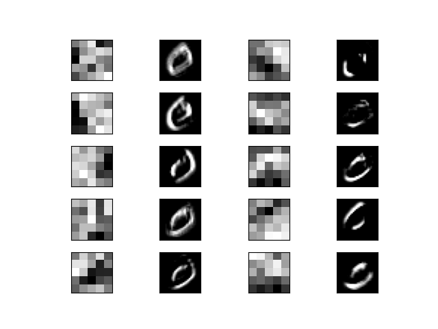
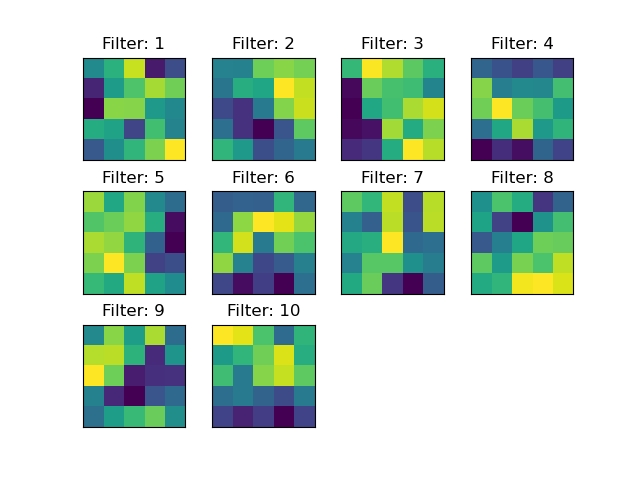

* task3 
These are results from greek letters transfer learning. The additional data are in data folder. It only takes 2 ephochs to let the model 100% recognize them.

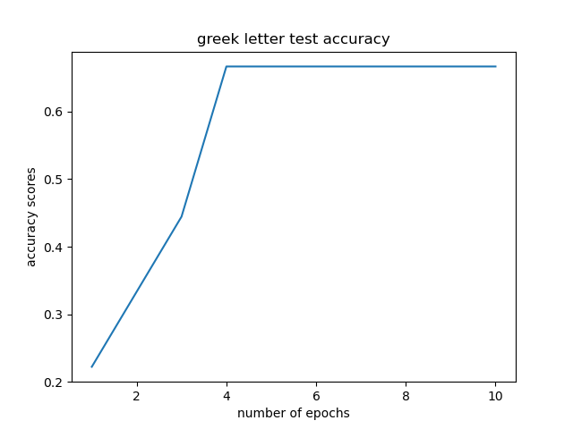
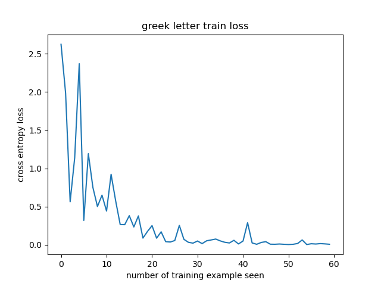
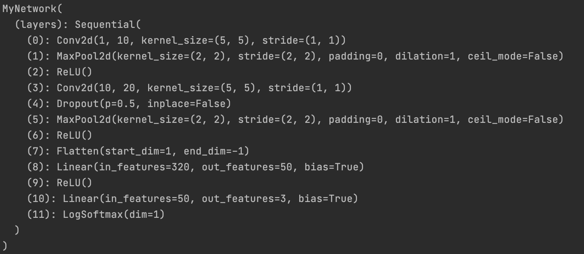

* task4

For the experimentation, we changed activation function, batch size, droupout rate, epoch number of the model.

For activation functions test accuracy, RELU, GELU are good mainstream ones, so we predict they have high test accuracy. Softmax, Sigmoid, Tanh are not so common, so as predicted they are not as good as activation functions above.
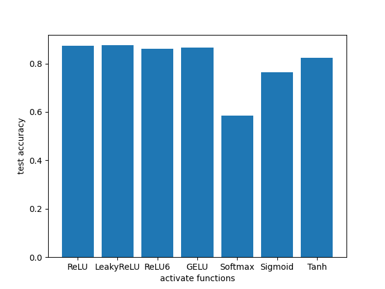

For activation functions train time, we expect they have similiar times.
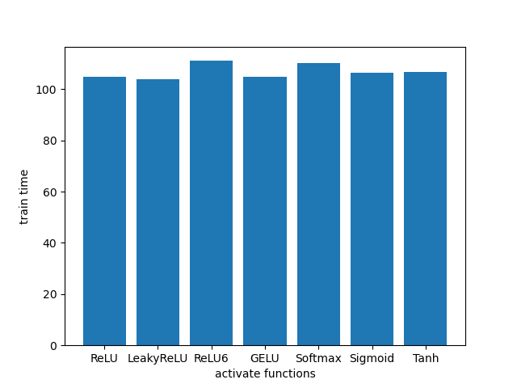

For the batchsize, it makes sense that the training time reduces as we increase the batch that we feed to the model. However, the accuracy drops with increased batchsize. That's the opposite of our prediction results.
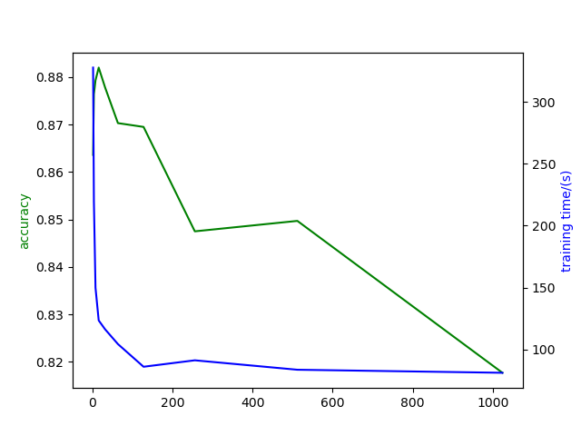

The dropout rate accuracy should reach the local maxima in the middle, and drop significantly in the end. Unfortunately, we don't see the local maxima. The training times on the other hand fluctuate up and down due to the fluctuation of computer calculation power.
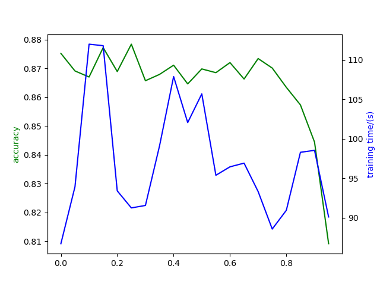

For epoch number, both train and test accuracy increase as more epoch number we use. In the end, the differences between the train and test accuracy are improved due to model overfitting.
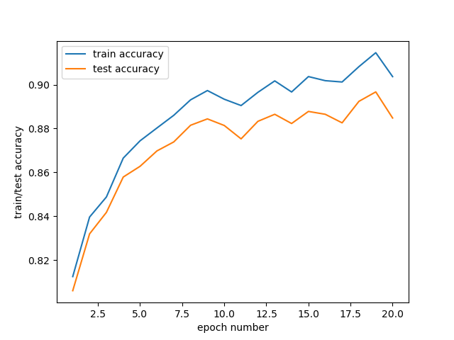

## A description and example images of any extensions.

This is our extension. We downloaded Resnet model from pytorch, and extracted first convolution layer' 12 filters. Finally, we applied the filter onto the number 0 and displayed in the graph.
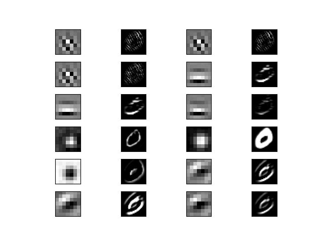
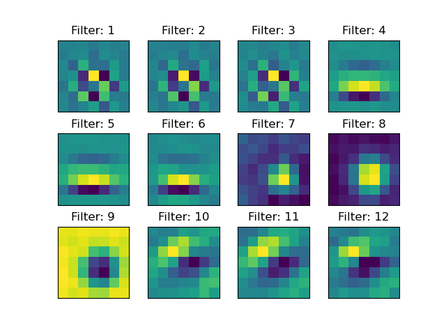

## A short reflection of what you learned.
* We learned the method to build a functional neural network. Call pytorch's API, create our own data.

## Acknowledgement of any materials or people you consulted for the assignment.
* We mainly consulted pytorch website (https://pytorch.org/)